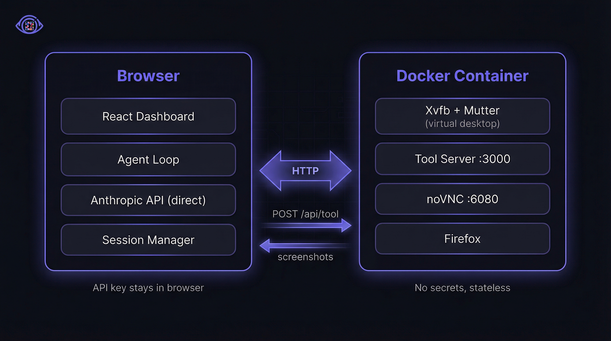

# compeek — AI Eyes & Hands for Any Desktop

> Tell the AI what to do. Point it at any software. Watch it work.
>
> No APIs. No plugins. No integrations. Just screen and keyboard.

[Try the Dashboard](https://compeek.rmbk.me) | [Docker Image](https://ghcr.io/uburuntu/compeek) | [npm](https://www.npmjs.com/package/@rmbk/compeek)


## What can it do?

**compeek** (компик + peek) turns Claude into a desktop agent that can use any application — just like a person sitting at a computer.

- **See** any application through screenshots
- **Think** through complex tasks step by step (you can watch it reason)
- **Act** with mouse clicks, keyboard typing, and scrolling
- **Read** documents like passports, IDs, and invoices
- **Validate** its own work by checking what it filled in
- **Show you everything** — a real-time dashboard shows what the AI sees and thinks

## Quick Start

### Option 1: One command (recommended)

```bash
npx @rmbk/compeek@latest start --open
```

This downloads a virtual desktop, starts it, and opens the dashboard in your browser.

### Option 2: Install script

```bash
curl -fsSL https://compeek.rmbk.me/install.sh | bash
```

### Option 3: Docker

```bash
docker run -d -p 3001:3000 -p 6081:6080 --shm-size=512m ghcr.io/uburuntu/compeek
```

After starting, check the terminal for a **clickable link** that connects the dashboard automatically. Or run `docker logs compeek-1` to see it.

Open the [dashboard](https://compeek.rmbk.me), paste your Anthropic API key in Settings, and start a workflow.

## How It Works



The AI runs **in your browser** — it looks at the virtual desktop, decides what to do, and sends mouse/keyboard commands. The virtual desktop is just a Linux computer in a container — no AI runs inside it.

<details>
<summary>Technical architecture details</summary>

The agent loop runs in the browser via `@anthropic-ai/sdk` with `dangerouslyAllowBrowser: true`.
It uses `computer_20250124`, `bash_20250124`, and `text_editor_20250728` tools.
Extended thinking is enabled with a 10240 token budget.

Each container runs Ubuntu 24.04 with Xvfb (1280x768), XFWM4, x11vnc, noVNC, and Firefox (with uBlock Origin).
The container exposes a minimal Express tool server with endpoints:
`GET /api/health`, `GET /api/info`, `POST /api/tool`, `POST /api/bash`.

Communication is HTTP-only. No WebSocket, no state in containers.

</details>

## Desktop Modes

Set `DESKTOP_MODE` when starting a container:

| Mode | What you get | Best for |
|------|-------------|----------|
| `full` (default) | Desktop + browser + sample app | Testing forms and web apps |
| `browser` | Desktop + browser | General web browsing |
| `minimal` | Desktop only | Let the AI install what it needs |
| `headless` | No visual — commands only | Automated scripts |

```bash
npx @rmbk/compeek@latest start --mode browser
# or
docker run -d -e DESKTOP_MODE=browser -p 3001:3000 -p 6081:6080 --shm-size=512m ghcr.io/uburuntu/compeek
```

## Connecting to a Desktop

The container prints a **connection code** and a **clickable link** when it starts:

```
Connection string: eyJuYW1lIj...
Dashboard link:    https://compeek.rmbk.me/#config=eyJuYW1lIj...
```

Three ways to connect:
1. **Click the link** in your terminal — auto-adds the session
2. **Paste the code** in the Add Session dialog
3. **Type the address** manually (host + ports)

## CLI

```bash
npx @rmbk/compeek@latest start          # Pull image, start container, print connection info
npx @rmbk/compeek@latest start --open   # Same + open dashboard in browser
npx @rmbk/compeek@latest stop           # Stop all compeek containers
npx @rmbk/compeek@latest stop 1         # Stop compeek-1
npx @rmbk/compeek@latest status         # List running containers
npx @rmbk/compeek@latest logs           # Follow container logs
npx @rmbk/compeek@latest open           # Open dashboard with auto-connect URL
```

Flags for `start`: `--name`, `--api-port`, `--vnc-port`, `--mode`, `--persist`, `--password`, `--tunnel`, `--no-pull`, `--open`.

| Flag | Description |
|------|-------------|
| `--open` | Open dashboard in browser after starting |
| `--mode <m>` | Desktop mode: `full`, `browser`, `minimal`, `headless` |
| `--persist` | Mount a named Docker volume so files survive container restarts |
| `--password <pw>` | Set a custom VNC password (auto-generated if omitted) |
| `--tunnel` | Create public URLs via localtunnel for remote access |

## Security

Each container auto-generates a **VNC password** on startup. The password is included in the connection link so the dashboard connects seamlessly — you don't need to type it.

You can set your own password with `--password`:

```bash
npx @rmbk/compeek@latest start --password mysecret
```

### Remote access

If you're running compeek on the same machine as your browser, everything works locally — no tunneling needed.

To access a container from another machine (e.g. a remote server), use `--tunnel` to create public URLs:

```bash
npx @rmbk/compeek@latest start --tunnel
```

This uses [localtunnel](https://theboroer.github.io/localtunnel-www/) to make the container reachable over the internet. The VNC desktop is password-protected, but the tool API currently has no authentication — use a VPN or firewall for sensitive environments.

## Development

```bash
npm install
npm run dev:client         # Vite dev server on :5173
npm run build              # tsc + vite build
npm test                   # 19 tests
docker compose up --build  # 3 containers on ports 3001-3003 / 6081-6083
```

## Project Structure

```
compeek/
├── src/
│   ├── agent/             # Shared tools, types, prompts
│   ├── app/               # React dashboard (Vite)
│   ├── container/         # Express tool server (Docker)
│   └── lib/               # Logger
├── bin/compeek.mjs        # CLI (npx compeek)
├── install.sh             # One-line installer
├── docker/                # Dockerfile + entrypoint
├── target-app/            # Demo form application
└── docker-compose.yml
```

## Built for

**"Built with Opus 4.6: a Claude Code Hackathon"** by Anthropic (Feb 2026)

## License

MIT
